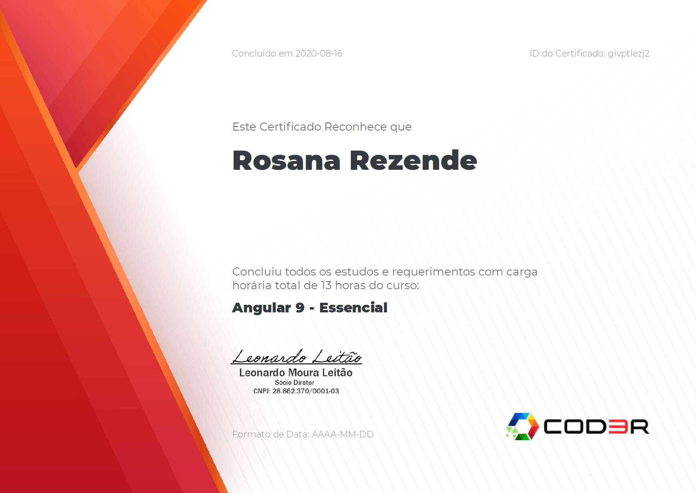

# Angular 9 Essencial | Projeto: CRUD - Cadastro de Produtos

**Professor**: _Leonardo Moura Leitao_

Mantido pela gigante da tecnologia Google, o Angular 9 é um dos principais frameworks frontend do mercado! 

O curso abordou:
- Componentes
- Módulos
- Diretivas
- Services
- Injeção de Dependências
- Pipes
- Navegação
- Observables
- Consumir uma API Rest

 

## Certificado

  

